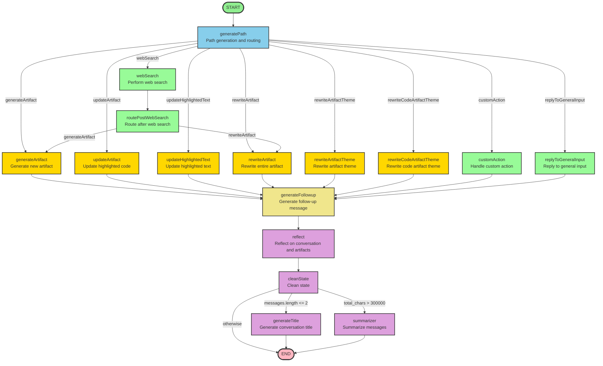
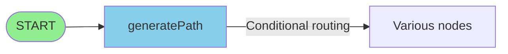
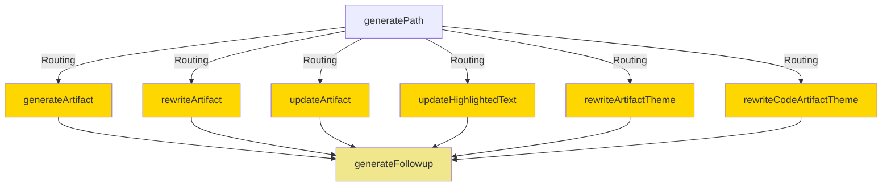
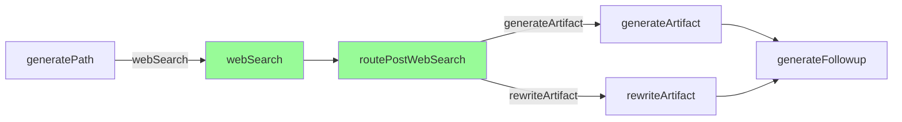
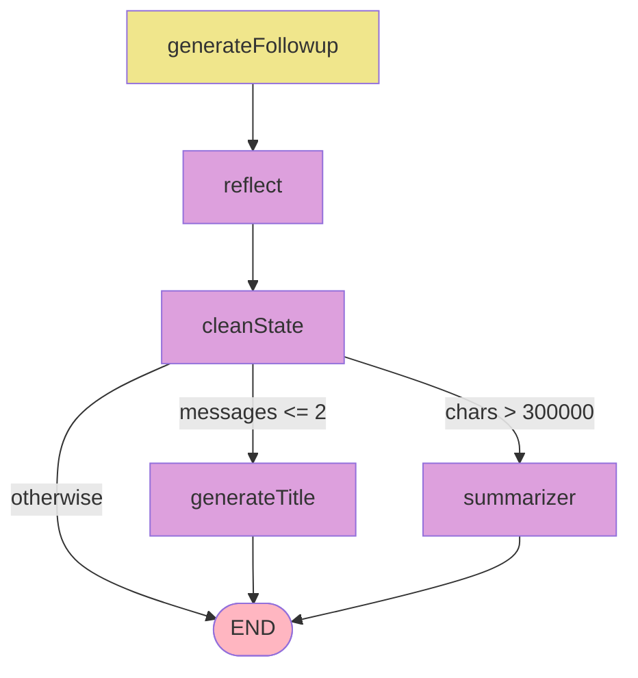

# Open Canvas LangGraph Diagram

This diagram visualizes the LangGraph structure of Open Canvas.

## Overall Graph Structure

## Step-by-Step Flow

### 1. Entry and Routing Stage

### 2. Artifact Processing Stage

### 3. Web Search Flow

### 4. Post-Processing and Termination Stage

## Node Descriptions

### Entry Point
- **generatePath**: Analyzes user requests and generates appropriate paths for routing.

### Artifact Generation/Modification Nodes
- **generateArtifact**: Generates new artifacts.
- **rewriteArtifact**: Rewrites entire artifacts.
- **updateArtifact**: Updates only highlighted code sections.
- **updateHighlightedText**: Updates highlighted text in markdown artifacts.
- **rewriteArtifactTheme**: Changes artifact themes (language, length, reading level, emoji).
- **rewriteCodeArtifactTheme**: Changes code artifact themes (comments, logs, language porting, bug fixes).

### Special Function Nodes
- **webSearch**: Performs web search.
- **routePostWebSearch**: Routes to the next node based on web search results.
- **customAction**: Handles user-defined quick actions.
- **replyToGeneralInput**: Responds to general input without artifact generation/modification.

### Post-Processing Nodes
- **generateFollowup**: Generates follow-up messages after artifact generation.
- **reflect**: Reflects on conversations and artifacts and stores them in memory.
- **cleanState**: Cleans state after processing.
- **generateTitle**: Generates conversation titles (for first conversation).
- **summarizer**: Summarizes messages when they become too long.

## Flow Description

1. **Start**: All requests start at the `generatePath` node.
2. **Routing**: `generatePath` routes to appropriate nodes based on request type.
3. **Web Search Path**: When web search is needed, artifacts are generated or rewritten based on search results.
4. **Artifact Processing**: Most artifact-related nodes move to `generateFollowup` after processing.
5. **Reflection and Cleanup**: After all processing is complete, reflection is performed and state is cleaned.
6. **Conditional Termination**: Moves to title generation, summarization, or termination based on message length and conversation state.

## Subgraph Diagrams

Open Canvas uses multiple subgraphs. Diagrams for each subgraph can be found in the README of the respective directory:

- **[Reflection Graph](./../reflection/README.md)**: Analyzes conversations and artifacts to generate style rules and memories
- **[Web Search Graph](./../web_search/README.md)**: Determines if web search is needed and performs search
- **[Summarizer Graph](./../summarizer/README.md)**: Summarizes long conversation messages
- **[Thread Title Graph](./../thread_title/README.md)**: Automatically generates conversation titles
