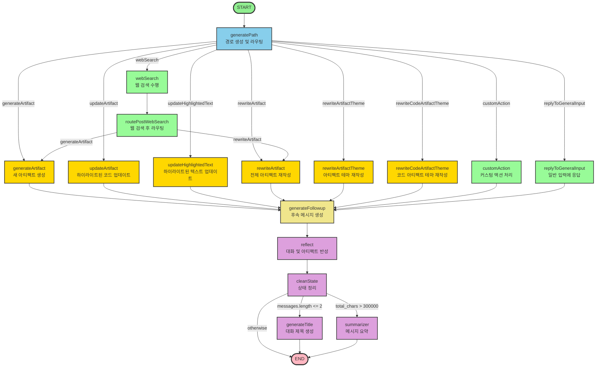
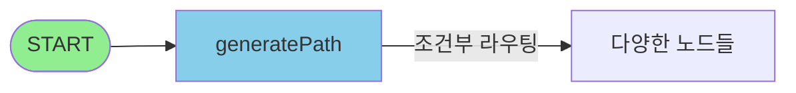
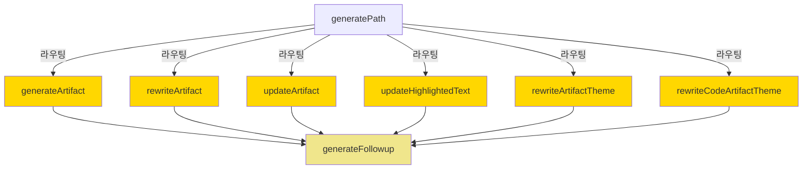
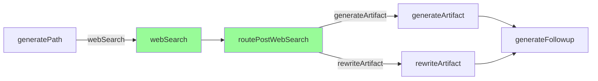
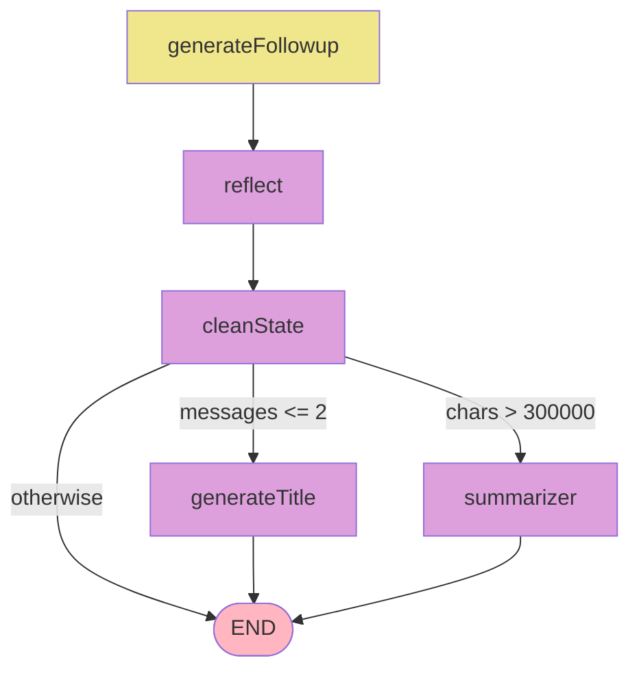

# Open Canvas LangGraph Diagram

이 다이어그램은 Open Canvas의 LangGraph 구조를 시각화합니다.

## 전체 그래프 구조

## 단계별 플로우

### 1. 진입 및 라우팅 단계

### 2. 아티팩트 처리 단계

### 3. 웹 검색 플로우

### 4. 후처리 및 종료 단계

## 노드 설명

### 진입점
- **generatePath**: 사용자 요청을 분석하여 적절한 경로를 생성하고 라우팅합니다.

### 아티팩트 생성/수정 노드
- **generateArtifact**: 새로운 아티팩트를 생성합니다.
- **rewriteArtifact**: 전체 아티팩트를 재작성합니다.
- **updateArtifact**: 하이라이트된 코드 부분만 업데이트합니다.
- **updateHighlightedText**: 마크다운 아티팩트의 하이라이트된 텍스트를 업데이트합니다.
- **rewriteArtifactTheme**: 아티팩트의 테마(언어, 길이, 읽기 수준, 이모지)를 변경합니다.
- **rewriteCodeArtifactTheme**: 코드 아티팩트의 테마(주석, 로그, 언어 포팅, 버그 수정)를 변경합니다.

### 특수 기능 노드
- **webSearch**: 웹 검색을 수행합니다.
- **routePostWebSearch**: 웹 검색 결과에 따라 다음 노드로 라우팅합니다.
- **customAction**: 사용자 정의 빠른 액션을 처리합니다.
- **replyToGeneralInput**: 아티팩트 생성/수정 없이 일반 입력에 응답합니다.

### 후처리 노드
- **generateFollowup**: 아티팩트 생성 후 후속 메시지를 생성합니다.
- **reflect**: 대화와 아티팩트를 반성하여 메모리에 저장합니다.
- **cleanState**: 처리 후 상태를 정리합니다.
- **generateTitle**: 대화 제목을 생성합니다 (첫 대화인 경우).
- **summarizer**: 메시지가 너무 길면 요약합니다.

## 플로우 설명

1. **시작**: 모든 요청은 `generatePath` 노드에서 시작됩니다.
2. **라우팅**: `generatePath`는 요청 유형에 따라 적절한 노드로 라우팅합니다.
3. **웹 검색 경로**: 웹 검색이 필요한 경우, 검색 후 결과에 따라 아티팩트를 생성하거나 재작성합니다.
4. **아티팩트 처리**: 대부분의 아티팩트 관련 노드는 처리 후 `generateFollowup`으로 이동합니다.
5. **반성 및 정리**: 모든 처리가 완료되면 반성하고 상태를 정리합니다.
6. **조건부 종료**: 메시지 길이와 대화 상태에 따라 제목 생성, 요약, 또는 종료로 이동합니다.

## 서브그래프 다이어그램

Open Canvas는 여러 서브그래프를 사용합니다. 각 서브그래프의 다이어그램은 해당 디렉토리의 README에서 확인할 수 있습니다:

- **[Reflection Graph](./../reflection/README.md)**: 대화와 아티팩트를 분석하여 스타일 규칙과 메모리 생성
- **[Web Search Graph](./../web_search/README.md)**: 웹 검색 필요 여부 판단 및 검색 수행
- **[Summarizer Graph](./../summarizer/README.md)**: 긴 대화 메시지 요약
- **[Thread Title Graph](./../thread_title/README.md)**: 대화 제목 자동 생성
