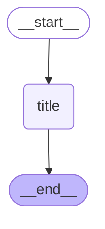

# Thread Title Graph

Thread Title 그래프는 대화의 제목을 자동으로 생성하는 서브그래프입니다.

## 그래프 구조

## 노드 설명

- **title**: 대화 메시지와 아티팩트를 분석하여 간결한 제목을 생성합니다. 생성된 제목은 스레드 메타데이터에 저장됩니다.

## 플로우

1. **시작**: `__start__` → `title`
2. **제목 생성**: LLM을 사용하여 대화 내용을 분석하고 제목 생성
3. **저장**: 생성된 제목을 스레드 메타데이터에 저장
4. **종료**: `title` → `__end__`

## 사용 위치

이 그래프는 `open_canvas` 메인 그래프의 `generateTitle` 노드에서 호출됩니다. 첫 번째 사용자-AI 대화(메시지가 2개 이하)일 때만 호출됩니다.

