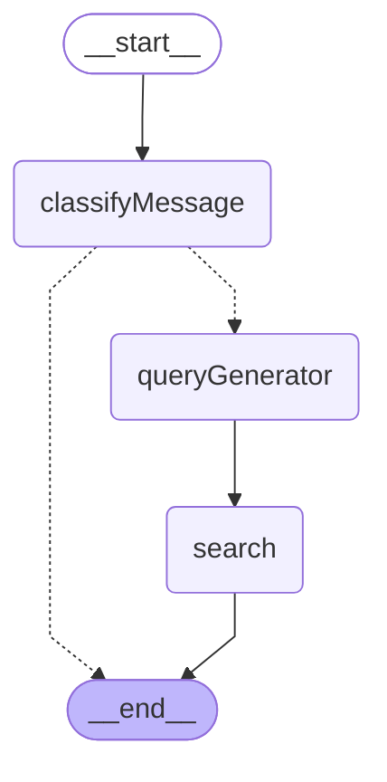

# Web Search Graph

Web Search 그래프는 사용자 메시지를 분석하여 웹 검색이 필요한지 판단하고, 필요시 검색 쿼리를 생성하여 웹 검색을 수행하는 서브그래프입니다.

## 그래프 구조

## 노드 설명

- **classifyMessage**: 사용자의 최신 메시지를 분석하여 웹 검색이 필요한지 판단합니다.
- **queryGenerator**: 웹 검색이 필요한 경우, 검색 엔진에 최적화된 쿼리를 생성합니다.
- **search**: Tavily API를 사용하여 실제 웹 검색을 수행하고 결과를 반환합니다.

## 플로우

1. **시작**: `__start__` → `classifyMessage`
2. **분류**: 메시지가 웹 검색을 필요로 하는지 판단
3. **조건부 라우팅**:
   - 검색 불필요: `classifyMessage` → `__end__`
   - 검색 필요: `classifyMessage` → `queryGenerator`
4. **쿼리 생성**: LLM을 사용하여 검색 쿼리 생성
5. **검색 수행**: Tavily API로 웹 검색 실행
6. **종료**: `search` → `__end__`

## 사용 위치

이 그래프는 `open_canvas` 메인 그래프의 `webSearch` 노드에서 호출됩니다.

