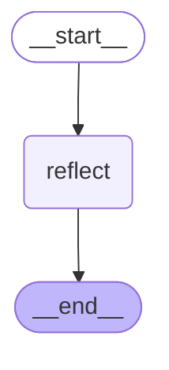

# Reflection Graph

The Reflection graph is a subgraph that analyzes conversations and artifacts to generate user style rules and memories.

## Graph Structure

## Node Description

- **reflect**: Analyzes conversation messages and artifacts to generate style rules and user memories, and stores them.

## Flow

1. **Start**: `__start__` → `reflect`
2. **Reflect**: Use LLM to analyze conversations and artifacts and generate new style rules and memories
3. **Store**: Store generated reflections in memory store
4. **End**: `reflect` → `__end__`

## Usage Location

This graph is called from the `reflect` node in the `open_canvas` main graph.

