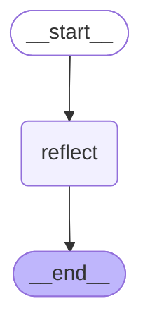

# Reflection Graph

Reflection 그래프는 대화와 아티팩트를 분석하여 사용자의 스타일 규칙과 메모리를 생성하는 서브그래프입니다.

## 그래프 구조

## 노드 설명

- **reflect**: 대화 메시지와 아티팩트를 분석하여 스타일 규칙과 사용자 메모리를 생성하고 저장합니다.

## 플로우

1. **시작**: `__start__` → `reflect`
2. **반성**: LLM을 사용하여 대화와 아티팩트를 분석하고 새로운 스타일 규칙과 메모리를 생성
3. **저장**: 생성된 반성을 메모리 스토어에 저장
4. **종료**: `reflect` → `__end__`

## 사용 위치

이 그래프는 `open_canvas` 메인 그래프의 `reflect` 노드에서 호출됩니다.

