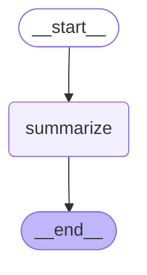

# Summarizer Graph

The Summarizer graph is a subgraph that compresses context by summarizing conversation messages when they become too long.

## Graph Structure

## Node Description

- **summarize**: Summarizes all conversation messages into a single summary message. The summary message is not visible to users and is used as context in subsequent conversations.

## Flow

1. **Start**: `__start__` → `summarize`
2. **Summarize**: Use LLM to summarize all messages
3. **Generate**: Add summarized message to `_messages` (not visible to users)
4. **End**: `summarize` → `__end__`

## Usage Location

This graph is called from the `summarizer` node in the `open_canvas` main graph. It is automatically called when the total message length exceeds 300,000 characters.

