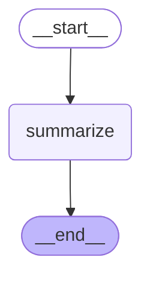

# Summarizer Graph

Summarizer 그래프는 대화 메시지가 너무 길어질 때 메시지를 요약하여 컨텍스트를 압축하는 서브그래프입니다.

## 그래프 구조

## 노드 설명

- **summarize**: 모든 대화 메시지를 요약하여 하나의 요약 메시지로 압축합니다. 요약 메시지는 사용자에게 보이지 않으며, 이후 대화에서 컨텍스트로 사용됩니다.

## 플로우

1. **시작**: `__start__` → `summarize`
2. **요약**: LLM을 사용하여 모든 메시지를 요약
3. **생성**: 요약된 메시지를 `_messages`에 추가 (사용자에게는 보이지 않음)
4. **종료**: `summarize` → `__end__`

## 사용 위치

이 그래프는 `open_canvas` 메인 그래프의 `summarizer` 노드에서 호출됩니다. 메시지 총 길이가 300,000자를 초과할 때 자동으로 호출됩니다.

