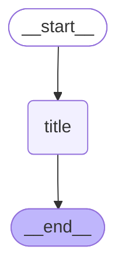

# Thread Title Graph

The Thread Title graph is a subgraph that automatically generates titles for conversations.

## Graph Structure

## Node Description

- **title**: Analyzes conversation messages and artifacts to generate a concise title. The generated title is stored in thread metadata.

## Flow

1. **Start**: `__start__` → `title`
2. **Title Generation**: Use LLM to analyze conversation content and generate title
3. **Store**: Store generated title in thread metadata
4. **End**: `title` → `__end__`

## Usage Location

This graph is called from the `generateTitle` node in the `open_canvas` main graph. It is only called when it's the first user-AI conversation (messages ≤ 2).

