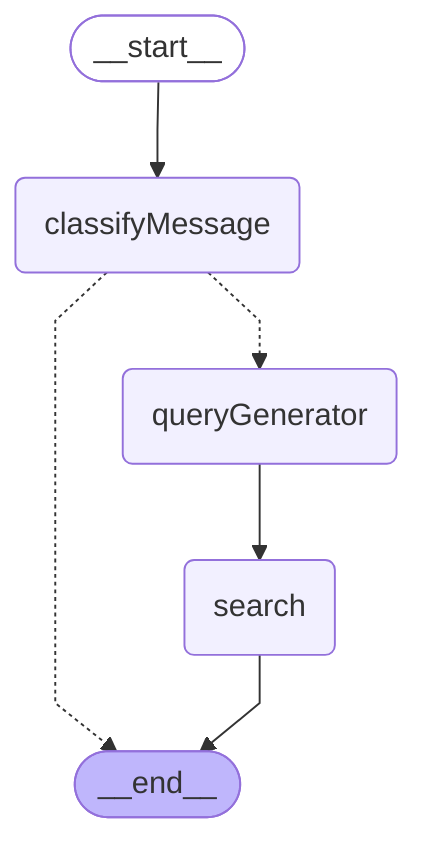

# Web Search Graph

The Web Search graph is a subgraph that analyzes user messages to determine if web search is needed, and if so, generates search queries and performs web search.

## Graph Structure

## Node Descriptions

- **classifyMessage**: Analyzes the user's latest message to determine if web search is needed.
- **queryGenerator**: When web search is needed, generates search engine-optimized queries.
- **search**: Performs actual web search using Tavily API and returns results.

## Flow

1. **Start**: `__start__` → `classifyMessage`
2. **Classification**: Determine if the message requires web search
3. **Conditional Routing**:
   - Search not needed: `classifyMessage` → `__end__`
   - Search needed: `classifyMessage` → `queryGenerator`
4. **Query Generation**: Use LLM to generate search query
5. **Search Execution**: Execute web search using Tavily API
6. **End**: `search` → `__end__`

## Usage Location

This graph is called from the `webSearch` node in the `open_canvas` main graph.

